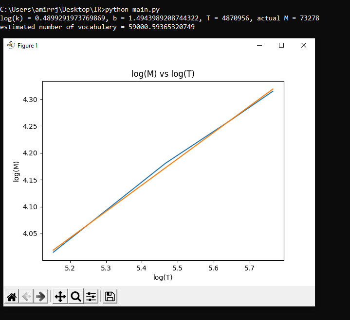

# Information-Retrieval

## [Phase 1](https://github.com/amirrezarajabi/Information-Retrieval/tree/main/IR_P1)
create simple search engine on persian news :)

gui

heaps with stem

heaps with stem

zipf with remove stopwords

zipf without remove stopwords

## [Phase 2](https://github.com/amirrezarajabi/Information-Retrieval/tree/main/IR_P2)
improve it using tf idf methode + (index elimination + champions list)

## [Phase 3](https://github.com/amirrezarajabi/Information-Retrieval/tree/main/IR_P3)
using elastic search for spell correction answer boolean query tf-idf method and implement k nearest-neighber
